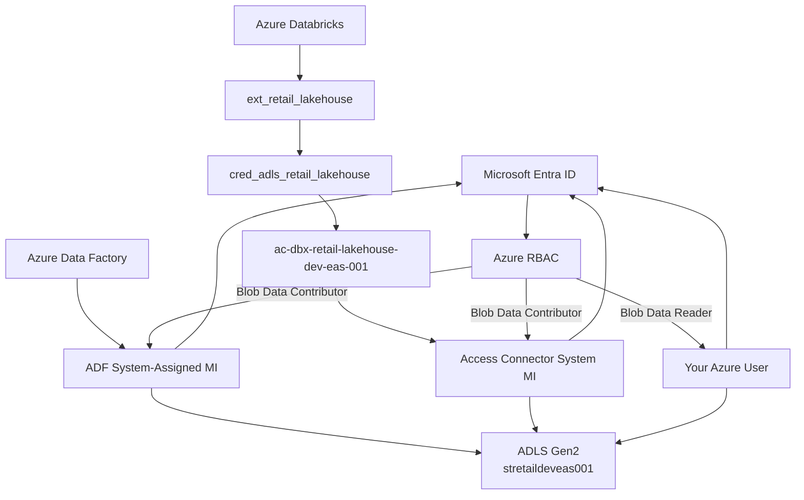

# Azure Retail Analytics Lakehouse Platform
## Current Architecture Map and Study Guide

**Project:** Azure Retail Analytics Lakehouse Platform  
**Environment:** Development / learning  
**Primary region:** East Asia (`eastasia`)  
**Current stage:** ADF ingestion is built; Databricks/Unity Catalog access to ADLS is established; first Spark notebook is ready.

---

## 1. Core mental model

```text
Sources
  |
  v
Azure Data Factory
  |  ingest + orchestrate
  v
ADLS Gen2
  |  durable storage
  v
Azure Databricks
  |  Spark / PySpark compute
  v
Bronze -> Silver -> Gold
```

Security is a separate path:

```text
ADF managed identity --------------------\
                                          \
Databricks Access Connector identity -----> Azure RBAC ---> ADLS Gen2
                                           /
Your Azure user --------------------------/
```

Different identities can access the same storage account, but Azure checks their permissions separately.

---

## 2. Azure hierarchy

```text
Microsoft Entra tenant
De La Salle University-Dasmariñas
        |
        v
Azure subscription
Azure for Students
        |
        +-- Cost Management budget: project2-student-budget
        |
        v
Resource Group
rg-retail-lakehouse-dev-eas-001
```

- **Tenant** = identity boundary.
- **Subscription** = billing and Azure resource-management boundary.
- **Resource group** = logical container for Project 2 resources.
- Region moved from Southeast Asia to **East Asia** because Azure for Students policy blocked Southeast Asia.

---

## 3. Resource inventory

| Type | Name | Role |
|---|---|---|
| Resource Group | `rg-retail-lakehouse-dev-eas-001` | Main Azure container |
| ADLS Gen2 | `stretaildeveas001` | Project data lake |
| ADLS filesystem | `lakehouse` | Contains source/landing/bronze/silver/gold |
| Azure Data Factory | `adf-retail-lakehouse-dev-eas-001` | Ingestion + orchestration |
| ADF Linked Service | `ls_adls_lakehouse` | Managed-identity connection to ADLS |
| ADF Linked Service | `ls_rest_dummyjson` | REST connection to DummyJSON |
| ADF Dataset | `ds_source_customers_csv` | Parameterized customers source file |
| ADF Dataset | `ds_landing_customers_sink_csv` | Parameterized customers Landing sink |
| ADF Dataset | `ds_rest_inventory_source` | Parameterized REST source |
| ADF Dataset | `ds_landing_inventory_json` | API JSON Landing sink |
| ADF Pipeline | `pl_ingest_customers_file_to_landing` | File -> Landing |
| ADF Pipeline | `pl_ingest_inventory_api_to_landing` | REST -> Landing |
| ADF ForEach | `foreach_inventory_pages` | Pages skip=0,50,100,150 |
| ADF Trigger | `tr_inventory_api_daily` | Schedule trigger; currently **Stopped** |
| Databricks Workspace | `dbw-retail-lakehouse-dev-eas-001` | Spark/PySpark platform |
| Databricks Access Connector | `ac-dbx-retail-lakehouse-dev-eas-001` | Azure managed-identity bridge |
| Unity Catalog Storage Credential | `cred_adls_retail_lakehouse` | Databricks auth object |
| Unity Catalog External Location | `ext_retail_lakehouse` | Governs project ADLS root |
| Notebook | `01_landing_exploration` | First Spark exploration notebook |
| Serverless compute | `Default Interactive Compute` | Notebook Spark compute |
| Serverless compute | `Default Automated Compute` | Jobs/pipelines compute |
| Databricks managed RG | `databricks-rg-dbw-retail-lakehouse-dev-eas-001-66kkbi8i8n09c` | Databricks-managed resources |
| Databricks managed storage | `dbstoragei7c52eslqdkmu` | Internal Databricks storage, not the project lake |

---

## 4. Naming convention

General Azure pattern:

```text
<resource-type>-<project>-<environment>-<region>-<instance>
```

Examples:

```text
rg-retail-lakehouse-dev-eas-001
adf-retail-lakehouse-dev-eas-001
dbw-retail-lakehouse-dev-eas-001
ac-dbx-retail-lakehouse-dev-eas-001
```

Meaning:

| Token | Meaning |
|---|---|
| `rg` | Resource Group |
| `st` | Storage Account |
| `adf` | Azure Data Factory |
| `dbw` | Databricks Workspace |
| `ac-dbx` | Databricks Access Connector |
| `retail-lakehouse` | Project |
| `dev` | Development |
| `eas` | East Asia |
| `001` | First instance |

Storage account names are stricter, so `stretaildeveas001` is the compact form.

ADF prefixes:

```text
ls_      linked service
ds_      dataset
pl_      pipeline
tr_      trigger
copy_    copy activity
foreach_ loop activity
```

Databricks / Unity Catalog:

```text
cred_    storage credential
ext_     external location
```

---

## 5. ADLS Gen2

Storage account:

```text
stretaildeveas001
```

Configuration:

```text
StorageV2
Standard_LRS
Hierarchical namespace enabled
Anonymous blob access disabled
East Asia
```

Filesystem:

```text
lakehouse/
├── source/
├── landing/
├── bronze/
├── silver/
└── gold/
```

### source/

Currently simulates an external batch-delivery source:

```text
source/customers/customers_2026-09-05.csv
source/customers/customers_2026-09-06.csv
```

This is a learning simulation. In production the source could be SFTP, SaaS, SQL Server, vendor blob storage, etc.

### landing/

Landing answers:

> What exactly arrived?

Examples:

```text
landing/customers/2026/09/02/customers_2026-09-02.csv
landing/customers/2026/09/05/customers_2026-09-05.csv
landing/customers/2026/09/06/customers_2026-09-06.csv
```

API data:

```text
landing/api/inventory/2026/09/06/inventory_2026-09-06.json

landing/api/inventory/2026/09/07/
├── inventory_page_001.json
├── inventory_page_002.json
├── inventory_page_003.json
└── inventory_page_004.json
```

Verified pagination:

```text
page 001 -> 50 records, skip 0
page 002 -> 50 records, skip 50
page 003 -> 50 records, skip 100
page 004 -> 44 records, skip 150
total    -> 194
```

### bronze/

Folder exists, but Bronze Delta tables are **not built yet**.

Purpose:

```text
source-aligned lakehouse records
```

### silver/

Folder exists, but Silver tables are **not built yet**.

Purpose:

```text
typed + validated + cleaned + deduplicated + trusted
```

### gold/

Folder exists, but Gold models are **not built yet**.

Purpose:

```text
business-ready facts, dimensions, marts
```

---

## 6. Arrival date vs business date

Example:

```text
landing/orders/2026/09/02/
```

That path date means **arrival date**, not necessarily the order date.

```text
Business event: 2026-09-01
File arrival:   2026-09-02
```

Remember:

```text
Landing path date = operational arrival date
Business date     = field inside the data
```

---

## 7. Rebuildability model

```text
Landing -> Bronze -> Silver -> Gold
```

Desired rule:

```text
Landing = preserved source history
Bronze  = rebuildable from Landing
Silver  = rebuildable from Bronze
Gold    = rebuildable from trusted lower layers
```

If Silver logic is wrong:

```text
fix code -> rebuild Silver -> rebuild Gold
```

---

## 8. Azure Data Factory

ADF resource:

```text
adf-retail-lakehouse-dev-eas-001
```

ADF responsibilities in this project:

```text
ingest
move data
orchestrate
parameterize
retry transient failures
schedule
monitor
```

Heavy transformation belongs to Databricks/Spark.

### ADF mental model

```text
Linked Service = HOW to connect
Dataset        = WHAT data/path/endpoint
Pipeline       = WHAT workflow
Activity       = WHAT operation
Trigger        = WHEN
Monitor        = WHAT happened
```

---

## 9. File ingestion flow

Objects:

```text
ls_adls_lakehouse
ds_source_customers_csv
pl_ingest_customers_file_to_landing
copy_customers_to_landing
ds_landing_customers_sink_csv
```

Flow:

```text
source/customers/<file>
        |
        v
ADF parameterized source dataset
        |
        v
Copy Activity
        |
        v
ADF parameterized sink dataset
        |
        v
landing/customers/YYYY/MM/DD/<file>
```

Pipeline parameters:

```text
source_name
year
month
day
file_name
```

Dynamic paths:

```text
source/{source_name}/{file_name}

landing/{source_name}/{year}/{month}/{day}/{file_name}
```

A major lesson from debugging:

```text
Pipeline Succeeded != correct data landed
```

Verification should include:

```text
pipeline status
activity metrics
resolved parameters
physical file
record counts
```

---

## 10. REST ingestion flow

Linked service:

```text
ls_rest_dummyjson
```

Source dataset:

```text
ds_rest_inventory_source
```

Pipeline:

```text
pl_ingest_inventory_api_to_landing
```

ForEach:

```text
foreach_inventory_pages
```

Inner activity:

```text
copy_inventory_page
```

The API learning source is DummyJSON Products, using the `stock` field as inventory-like data.

Pagination:

```text
limit=50&skip=0
limit=50&skip=50
limit=50&skip=100
limit=50&skip=150
```

Because ForEach was not sequential, pages could run concurrently.

Production warning:

```text
parallelism can trigger API rate limits / HTTP 429 / quotas
```

---

## 11. Trigger and Monitor

Trigger:

```text
tr_inventory_api_daily
```

Current state:

```text
Stopped
```

It ran successfully once for learning, then was stopped to avoid unnecessary recurring cloud activity.

Remember:

```text
Debug run    = developer manually tests
Triggered run = schedule/event/manual trigger starts published pipeline
```

---

## 12. ADF identity and access

ADF has a **system-assigned managed identity**.

That identity has:

```text
Storage Blob Data Contributor
```

on:

```text
stretaildeveas001
```

Flow:

```text
ADF
 |
system-assigned managed identity
 |
Microsoft Entra ID
 |
Azure RBAC
 |
Storage Blob Data Contributor
 |
ADLS Gen2
```

No storage account key is embedded in the pipeline.

---

## 13. Your personal Azure identity

Your signed-in Azure user has:

```text
Storage Blob Data Reader
```

on the project storage account.

This is why you can:

```text
list files
download files
verify output with Azure CLI
```

You experienced RBAC propagation delay after assigning this role.

Important:

```text
Your user identity != ADF identity != Databricks identity
```

---

## 14. Azure Databricks

Workspace:

```text
dbw-retail-lakehouse-dev-eas-001
```

Observed:

```text
Premium
East Asia
Hybrid workspace
Unity Catalog enabled
Serverless available
```

Databricks responsibility:

```text
Spark / PySpark compute
Landing -> Bronze
Bronze -> Silver
Delta Lake
later analytical processing
```

Serverless compute:

```text
Default Interactive Compute
Default Automated Compute
```

Use Interactive Compute for notebooks.

---

## 15. Databricks managed Azure resources

Azure/Databricks also created:

```text
databricks-rg-dbw-retail-lakehouse-dev-eas-001-66kkbi8i8n09c
dbstoragei7c52eslqdkmu
```

These are Databricks-managed resources.

Do not confuse:

```text
stretaildeveas001 = YOUR project lake
dbstoragei7c52eslqdkmu = Databricks internal/workspace storage
```

---

## 16. Unity Catalog

Unity Catalog is governance + metadata.

```text
ADLS         = physical files / bytes
Unity Catalog = metadata + governance + permissions
```

Visible catalogs include:

```text
dbw_retail_lakehouse_dev_eas_001
system
hive_metastore
```

Project Bronze/Silver/Gold schemas and Delta tables are **not created yet**.

---

## 17. Where is the database?

There is no conventional Project 2 Azure SQL/PostgreSQL database at this stage.

This is a lakehouse.

```text
Physical storage: ADLS Gen2
Metadata/governance: Unity Catalog
Compute: Databricks / Spark
Table format later: Delta Lake
```

Future logical hierarchy may look like:

```text
Catalog
├── bronze schema
│   ├── customers
│   ├── products
│   ├── orders
│   └── inventory
├── silver schema
│   ├── customers
│   ├── products
│   ├── orders
│   └── inventory
└── gold schema
    ├── dim_customer
    ├── dim_product
    └── fact_order_items
```

That is future state.

---

## 18. Databricks Access Connector

Azure resource:

```text
ac-dbx-retail-lakehouse-dev-eas-001
```

It has a system-assigned managed identity.

That identity has:

```text
Storage Blob Data Contributor
```

on:

```text
stretaildeveas001
```

This is the Azure-side identity bridge for Unity Catalog.

---

## 19. Storage Credential

Unity Catalog object:

```text
cred_adls_retail_lakehouse
```

Meaning:

```text
Access Connector = actual Azure identity resource
Storage Credential = Databricks object representing that identity
```

---

## 20. External Location

Unity Catalog object:

```text
ext_retail_lakehouse
```

URL:

```text
abfss://lakehouse@stretaildeveas001.dfs.core.windows.net/
```

Uses:

```text
cred_adls_retail_lakehouse
```

Mental model:

```text
Storage Credential = WHO / HOW
External Location  = WHERE
```

Full chain:

```text
Databricks
  |
External Location
ext_retail_lakehouse
  |
Storage Credential
cred_adls_retail_lakehouse
  |
Azure Access Connector
ac-dbx-retail-lakehouse-dev-eas-001
  |
System-assigned managed identity
  |
Storage Blob Data Contributor
  |
stretaildeveas001
  |
lakehouse/
```

---

## 21. File-events warning

External Location checks passed for:

```text
Read
List
Write
Delete
Path Exists
Hierarchical Namespace
```

File Events provisioning failed.

You used **Force create**.

Meaning:

```text
normal Databricks read/write works
file-event optimization is unavailable
directory listing is used instead
```

This is acceptable for the current learning data volume.

It may matter later for large Auto Loader/event-driven ingestion.

---

## 22. First Spark notebook

Notebook:

```text
01_landing_exploration
```

First intended code:

```python
customers_path = "abfss://lakehouse@stretaildeveas001.dfs.core.windows.net/landing/customers/2026/09/06/customers_2026-09-06.csv"

df_customers = (
    spark.read
    .option("header", True)
    .csv(customers_path)
)

display(df_customers)
```

Then:

```python
df_customers.printSchema()
```

Mental model:

```text
spark        = Spark entry point
spark.read   = create read operation
DataFrame    = distributed table-like object
display(df)  = Databricks visualization
printSchema  = inspect Spark column types
```

---

## 23. Grain

Always ask:

> What should one row represent?

Current source grains:

```text
customers = one customer source record
products  = one product source record
orders    = one order-product transaction record
inventory = one stock/product observation in the learning API
```

Grain affects:

```text
keys
duplicates
joins
aggregations
facts
dimensions
incremental logic
```

---

## 24. Control plane vs data plane

### Control plane

```text
create storage account
create ADF
create Databricks workspace
assign roles
configure resources
```

### Data plane

```text
read CSV
write JSON
list Landing directory
download file
Spark reads data
```

You experienced this directly: being able to create Azure resources did not automatically give your user permission to read ADLS files.

---

## 25. Data flow vs deployment flow

Data flow:

```text
Source -> ADF -> Landing -> Databricks -> Bronze -> Silver -> Gold
```

Deployment flow later:

```text
Git -> GitHub -> GitHub Actions -> Terraform/deployment -> Azure
```

Data flow moves business data.

Deployment flow moves engineering changes.

---

## 26. Resource tags

Current manually created resources use:

```text
Project=azure-retail-lakehouse
Environment=dev
ManagedBy=manual
Purpose=data-engineering-learning
```

Later Terraform-managed resources should use a `ManagedBy=terraform` convention.

---

## 27. What exists vs what is next

### Built

```text
Azure foundations
ADLS Gen2
Landing
ADF file ingestion
ADF REST ingestion
pagination
parameterization
failure handling
monitoring
schedule-trigger demonstration
Databricks Premium workspace
serverless compute
Unity Catalog
Access Connector
Storage Credential
External Location
first Spark notebook
```

### Not yet built

```text
Bronze Delta tables
Silver trusted tables
Gold dimensional models
dbt models/tests
incremental Delta MERGE
production Databricks jobs
ADF -> Databricks orchestration
Key Vault
Terraform
GitHub Actions CI/CD
full observability
failure/recovery drills
final portfolio documentation
```

---

## 28. Complete architecture diagram

```mermaid
flowchart LR
    USER["Engineer / Azure CLI"]

    subgraph AZ["Azure for Students - East Asia"]
        subgraph RG["rg-retail-lakehouse-dev-eas-001"]
            ADF["ADF<br/>adf-retail-lakehouse-dev-eas-001"]
            ST["ADLS Gen2<br/>stretaildeveas001"]
            DBW["Azure Databricks<br/>dbw-retail-lakehouse-dev-eas-001"]
            AC["Access Connector<br/>ac-dbx-retail-lakehouse-dev-eas-001"]
        end
    end

    FILE["File source simulation"]
    API["DummyJSON REST API"]

    subgraph FS["lakehouse filesystem"]
        SOURCE["source/"]
        LAND["landing/"]
        BRONZE["bronze/<br/>NEXT"]
        SILVER["silver/<br/>FUTURE"]
        GOLD["gold/<br/>FUTURE"]
    end

    subgraph UC["Unity Catalog / Databricks"]
        CRED["cred_adls_retail_lakehouse"]
        EXT["ext_retail_lakehouse"]
        NB["01_landing_exploration"]
        SPARK["Serverless Spark"]
    end

    FILE --> ADF
    API --> ADF
    ADF -->|"Copy / ForEach"| LAND
    ST --- FS

    ADF -. "System MI + Blob Data Contributor" .-> ST

    DBW --> EXT
    EXT --> CRED
    CRED --> AC
    AC -. "System MI + Blob Data Contributor" .-> ST

    LAND -->|"spark.read"| NB
    NB --> SPARK
    SPARK --> BRONZE
    BRONZE --> SILVER
    SILVER --> GOLD

    USER -. "Blob Data Reader"| ST
```

---

## 29. Identity/access diagram



---

## 30. How to render the diagrams for free

### Mermaid Live Editor

1. Open Mermaid Live Editor in a browser.
2. Open the `.mmd` file supplied with this guide, or copy a Mermaid code block from this document.
3. Paste the code into the editor's **Code** panel.
4. The preview updates automatically.
5. Export SVG/PNG for a README or portfolio.

Mermaid is particularly convenient because GitHub Markdown can also display Mermaid diagrams.

### Graphviz Online

1. Open GraphvizOnline or another web Graphviz editor.
2. Open the `.dot` file supplied with this guide.
3. Paste the DOT source into the editor.
4. Render using the `dot` engine.
5. Export SVG/PNG.

---

## 31. Recommended repo placement

```text
docs/architecture/
├── current-architecture.md
├── azure-overview.mmd
├── identity-access.mmd
└── azure-overview.dot
```

---

## Final memory map

```text
ADF        = ingest + orchestrate
ADLS       = persist
Databricks = compute + transform
Spark      = distributed processing engine
PySpark    = Python API for Spark
Delta      = lakehouse table layer
Unity Catalog = metadata + governance + governed storage access
dbt later  = analytical SQL models + tests
```

And:

```text
Sources
  ↓
ADF
  ↓
ADLS Landing
  ↓
Databricks / Spark
  ↓
Bronze
  ↓
Silver
  ↓
Gold
```
